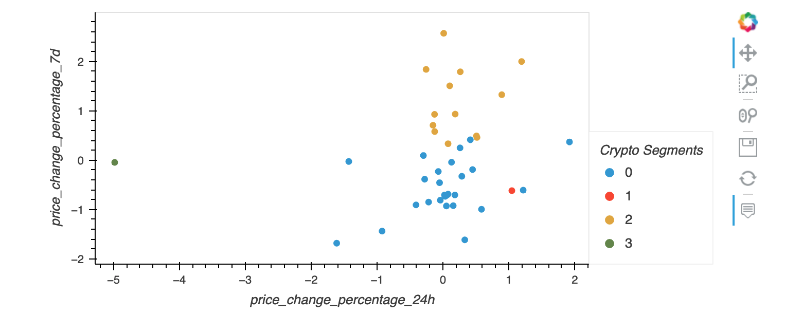

# Crypto Clustering

The notebook clusters crypto investments using the KMeans algorithm as well with standard scalling. 

---

## Technologies

Python 3.9

* [pandas](https://pandas.pydata.org/docs/getting_started/overview.html) 
* [hvplot](https://hvplot.holoviz.org/)
* [sklearn](https://scikit-learn.org/stable/)

---

## Installation Guide

```python
  pip install pandas
  pip install hvplot
  pip install sklearn
```

---

## Usage

This notebook visualizes and scales crypto investments into clusters using the KMeans algorithm. It could be a great example of the use of the elbo method for fiding an appropriate amount of clusters for the KMeans algorithm.


---

## Contributors

Main contributer **Santiago Hernandez**
- [dsmannight@gmail.com](dsmannight@gmail.com)

---

## License

This application is free for non-profit use.
